
# Chessico

It is a chess game but not like any normal chess , it has some modifications as for example the bishop has a new special move, some of the other pieces has some modifications that will be discussed downwards

## Table of Contents

- Introduction
- Features
- [Usage]
- [Authors]
- [Modified Moves]
- [Screenshots}
- [Support]
- [Roadmap]
- [Changelog]

## Introduction

This is a chess game done in Java Language as project of OOP course (CMP1242) in the university.
The game has some modifications in the moves allowed for some pieces. We used JDK 19 and JSwing for GUI.

## Features

- Chess gameplay with some modifications
- Play against another human
- Checkmate detection
- Pawn promotion
- Castling
- Timer

## Usage

You can run the game by the main function in the code or by using the configuration named "Chessico".

Once you launch the game , you can enter your username and password or you can play as guest.

After that , you can choose the theme of the board (its color) and you can choose also the time allowed for each player, the default time is 5 minutes for each player.

Once you start the game , the white must play. In order to play , you press on the piece you want to move then valid moves for this piece will show up in green color while the invalid will be in red color.(Note: valid and invalid moves only appear for the applicable moves for each piece). 

In each player's turn,his timer starts counting down until he plays his move then his timer stops and the other player's timer starts. If a player's timer reaches zero , it's gameover and he loses.

Castling : If the king and the rook didn't move from the initial position , there is no pieces between them and the king isn't under check then castling can occur

Pawn promotion: if the pawn reach the other end of the board , it can be replaced by any piece you want.

## Moves Modified
- Pawn: Can eat the piece in the square in front of it
- Bishop:  can move one square horizontally / moves only three squares on the diagonal and can jump over a piece in his way. 
- Knight: can  move  in  an  L  shape,  with  two  squares  horizontally  or  vertically,  and then  three  squares  in  the  perpendicular  direction.

## ScreenShots
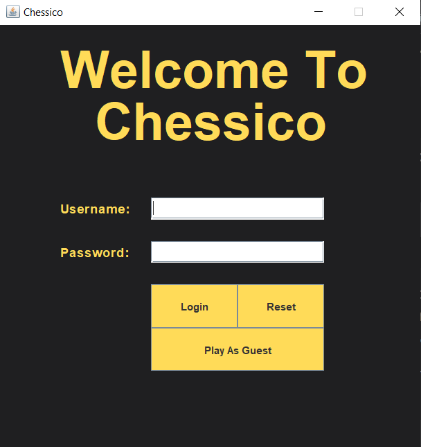
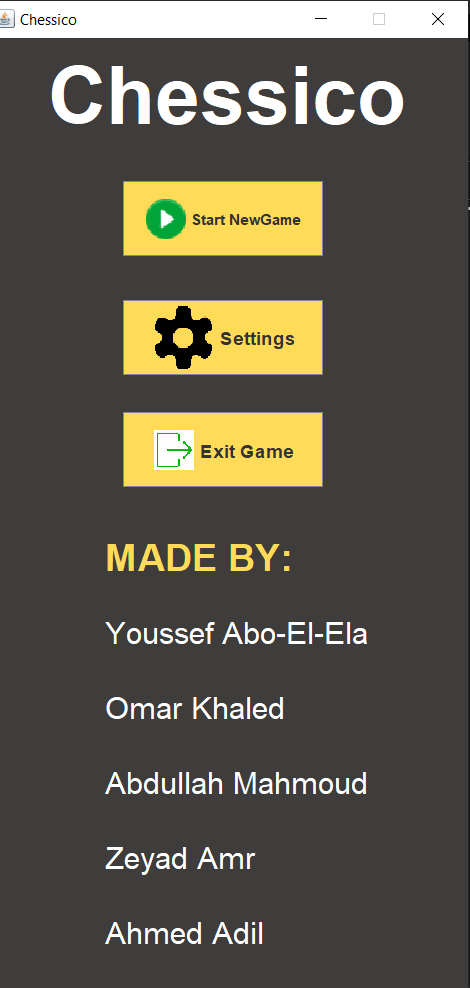
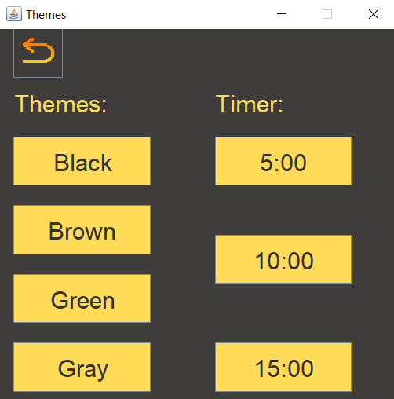
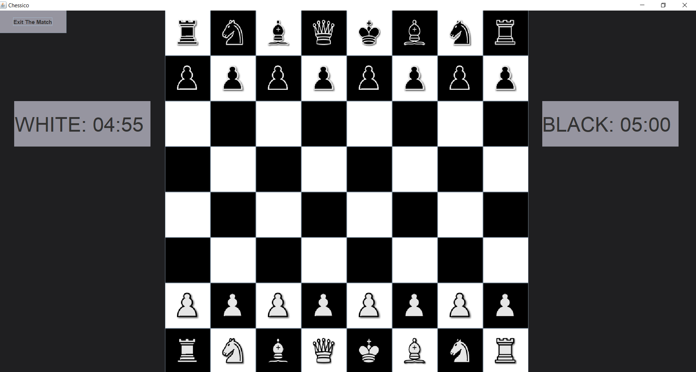
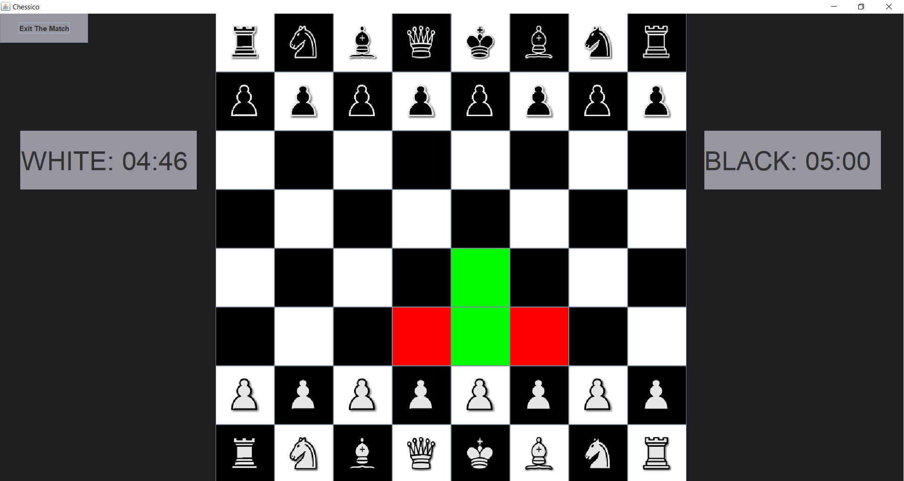
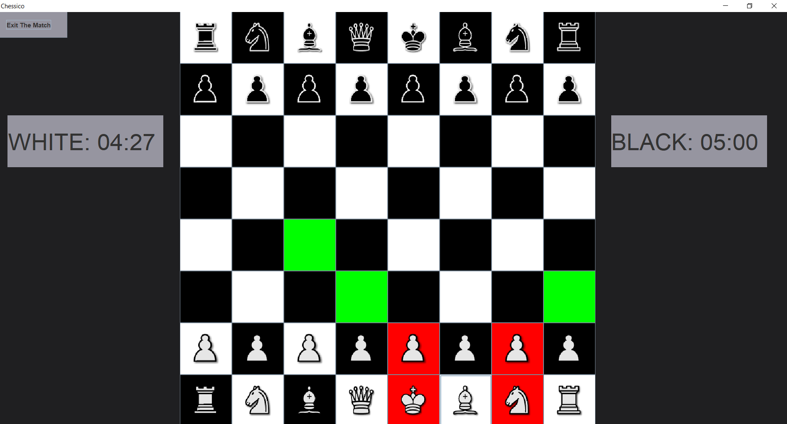
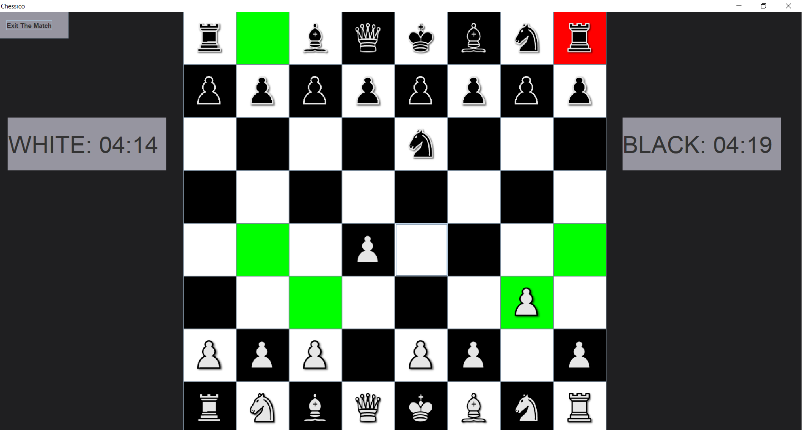
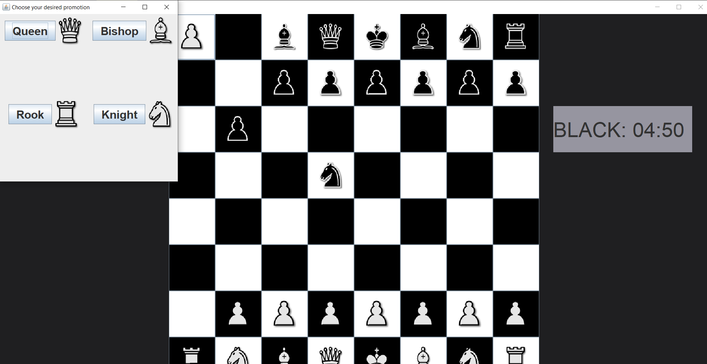
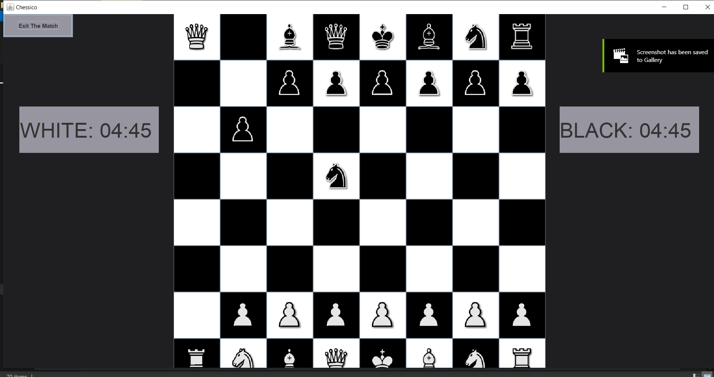
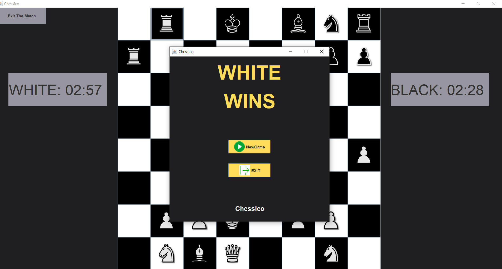
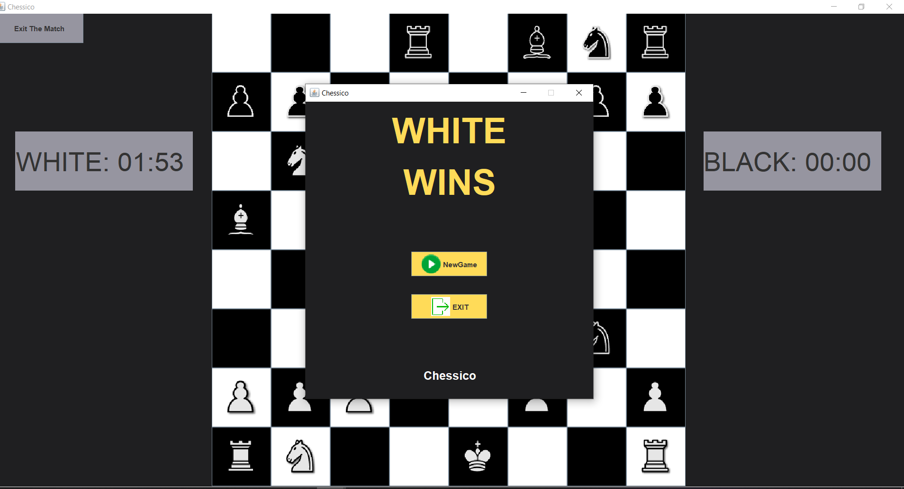

## Authors

- Zeyad Amr
- Youssef Abo-El-Ela
- Omar Khaled
- Abdallah Mahmoud
- Ahmed Adil
- Under the supervision of Prof. Amira Gaber and Eng. Mohamed Mustafa

## Troubleshooting

- Error:Pieces' Icons may not appear when starting a new game
- Solution: Make sure that the pieces' icons are in the project folder outside the "src" folder 

## Support

For support contact us at

Email: youssefmm2003@gmail.com

Email: zisco2002@gmail.com

## Roadmap

- Linking user account to a database
- Adding arcade modes
- Improving GUI

## Changelog

This is still the first version V 1.0 
